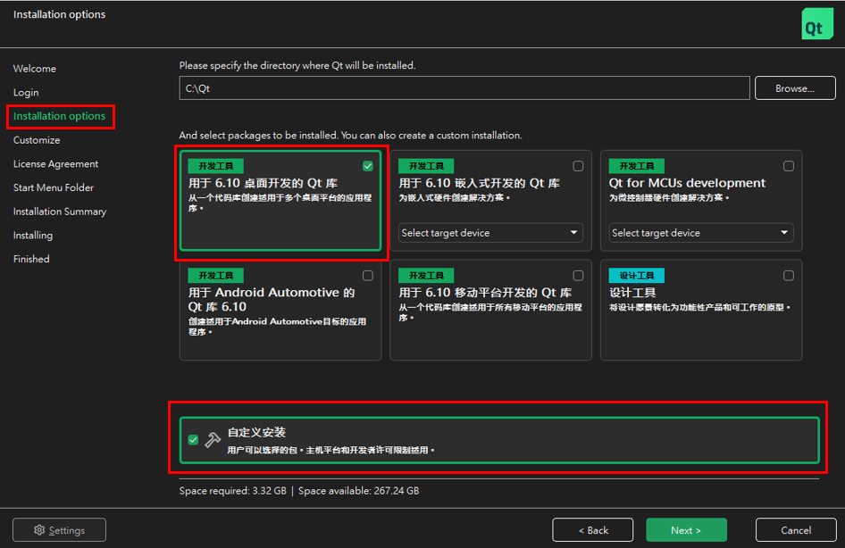
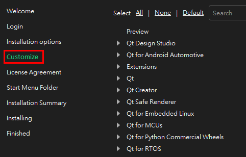
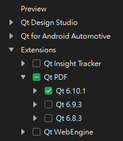
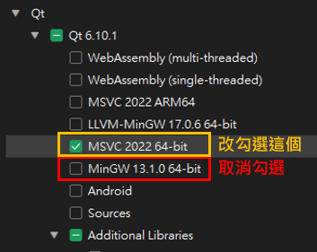
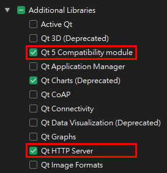
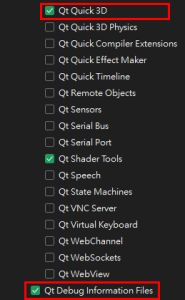
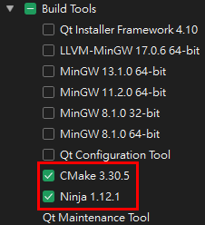
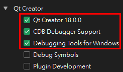
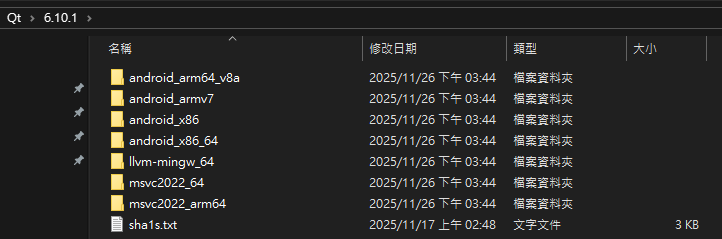
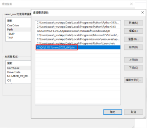

# GPT4all User Guide

## Overview
This application allows users to ask questions from the text user provided. This functionality achieves quick responses from the LLM, enhancing the overall user experience.

---
## Chapter 1: Installation and Setting

### Installation Steps

A. Git clone project

git clone https://github.com/nomic-ai/gpt4all.git --recursive 


B.0 Download cmake

https://cmake.org/download/
Make sure cmake is added to the system PATH environment variable


B.1 Download Visual Studio

https://visualstudio.microsoft.com/
Select C++ desktop development


B. Build backend

```bash
cd gpt4all\gpt4all-backend #Enter the backend directory
cmake -B build -DCMAKE_BUILD_TYPE=RelWithDebInfo -DLLMODEL_CUDA=OFF -DLLMODEL_KOMPUTE=OFF #configuration (disable CUDA & kompute)
cmake --build build --parallel #build
cd .. 
 ---OR---
cd gpt4all\gpt4all-backend #Enter the backend directory
& "C:\Program Files\CMake\bin\cmake.exe" -G "Visual Studio 18 2026" -B build -DCMAKE_BUILD_TYPE=RelWithDebInfo -DLLMODEL_CUDA=OFF -DLLMODEL_KOMPUTE=OFF
& "C:\Program Files\CMake\bin\cmake.exe" --build build --parallel
cd ..  
```

C. Install Python bindings (For develop)

cd gpt4all/gpt4all-bindings/python
pip install -e .


D. Build Desktop APP

1. Qt Installation & Settings
Download Qt installer from https://www.qt.io/download-qt-installer-oss (Need register)
(1) In the Installation options stage, check Qt libraries for 6.10 desktop development & custom installation

(2) In the Customize stage

▼ Under Extensions, check Qt PDF (Check the latest version)

▼ Under Qt, check the latest version, uncheck MinGW, and check MSVC instead

▼ Under Qt - Latest version - Additional Libraries, check the following:

Qt 5 Compatibility module
Qt HTTP Server
Qt Quick 3D
Qt Debug Information Files



▼ Under Qt - Build Tools, check CMake & Ninja


▼ Under Qt Creator, check the following:

Qt Creator
CDB Debugger Support
Debugger Tools for Windows


(3) Then proceed with the installation in order

(4) After installation, navigate to the Qt directory. If the mingw_64 directory appears, be sure to delete it to ensure MSVC compilation is used



2. Build

cd gpt4all\gpt4all-chat

(1) Add find_package(Qt${QT_VERSION_MAJOR} COMPONENTS GuiPrivate REQUIRED) at line 20 in .\deps\QXlsx\QXlsx\CMakeLists.txt

if(NOT DEFINED QT_VERSION_MAJOR)
    find_package(QT NAMES Qt6 Qt5 COMPONENTS Core Gui REQUIRED)
endif()
find_package(Qt${QT_VERSION_MAJOR} COMPONENTS Core Gui REQUIRED)
find_package(Qt${QT_VERSION_MAJOR} COMPONENTS GuiPrivate REQUIRED) #add this line
set(EXPORT_NAME QXlsxQt${QT_VERSION_MAJOR})

(2) Add the Qt MSVC path to the system PATH environment variable


(3) Build
```
cmake -B build -DLLMODEL_CUDA=OFF -DLLMODEL_KOMPUTE=OFF #configure environment
cmake --build build --config Release #build
windeployqt chat.exe --qmldir C:\Qt\6.10.1\msvc2022_64\qml 
# windeployqt should be at C:\Qt\6.10.1\msvc2022_64\bin，please set as PATH or direct using windeployqt.exe
```
(4) The generated exe will be at gpt4all\gpt4all-chat\build\bin\chat.exe

**E. Download and Place Embedding Model (Required for LocalDocs)**

The LocalDocs feature requires an embedding model to generate vector embeddings for your documents. You need to manually download and place the embedding model file.

1. **Download the embedding model:**
   - Download URL: https://gpt4all.io/models/gguf/nomic-embed-text-v1.5.f16.gguf
   - File name: `nomic-embed-text-v1.5.f16.gguf`
   - File size: ~274 MB

2. **Place the embedding model file:**
   - The embedding model must be placed in a `resources` folder that is **one level up** from where `chat.exe` is located.
   - **If `chat.exe` is at:** `aiDAPTIV_Files\Installer\chat.exe`
   - **Then place the model at:** `aiDAPTIV_Files\resources\nomic-embed-text-v1.5.f16.gguf`
   
   Directory structure example:
   ```
   aiDAPTIV_Files/
   ├── Installer/
   │   └── chat.exe          ← Your executable
   └── resources/            ← Create this folder if it doesn't exist
       └── nomic-embed-text-v1.5.f16.gguf  ← Place the model here
   ```

3. **Verify the setup:**
   - After placing the model file, launch `chat.exe`
   - If the model is correctly placed, LocalDocs will work without warnings
   - If you see "Local embedding model not found" warning, check that:
     - The `resources` folder exists at the correct location
     - The file name is exactly `nomic-embed-text-v1.5.f16.gguf`
     - The file is not corrupted (re-download if needed)

**Note:** The embedding model is required for the LocalDocs feature to function. Without it, you will not be able to create collections or generate embeddings for your documents.

F. If files are modified

You can compile only the modified files
```
cd \gpt4all\gpt4all-chat\build

cmake --build . --target <modified file name> --config Release #<modified file name> does not need to include file extension
```
---

## Chapter 2: How to Use?

### Usage Workflow

1. **Initial Setup**
- Click on `chat.exe` to launch the chat interface. The chat room automatically created. 
- **Please double check the existent of embedding model, if not please check section E. (Download and Place Embedding Model)**


2. **Set LLM Endpoint**
- Fill in the **LLM Endpoint** and **Model Name** as required.


3. **Set RAG**
- Add a collection and set the folder path. It will automatically pull all the files from the folder path and insert to the collection.
- Please wait for the Ready sign of all collections.


4. **Ask questions**
- Select the collection on the right side. You can start asking questions about the texts you uploaded.
