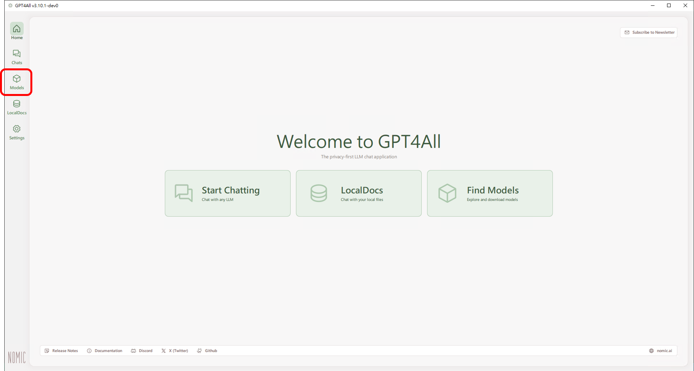
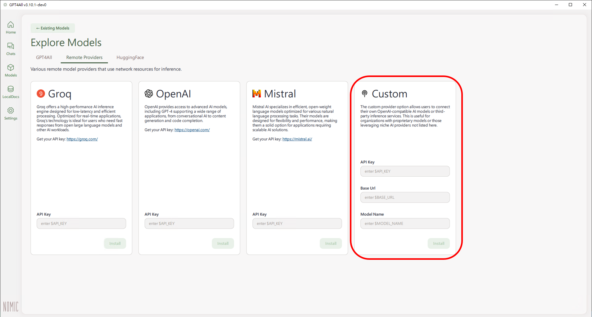
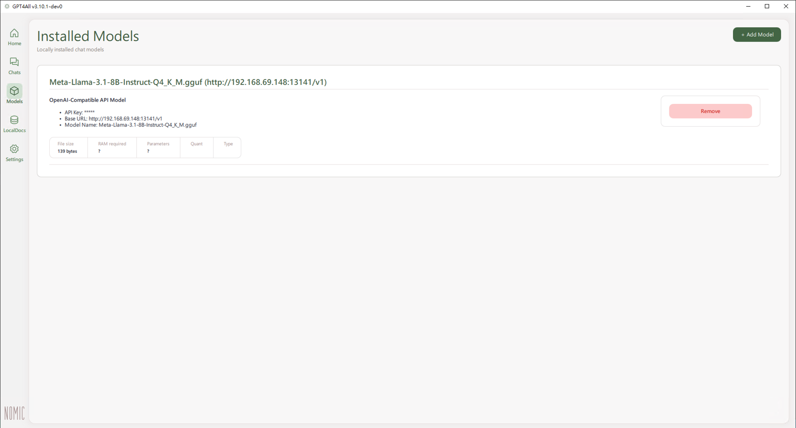
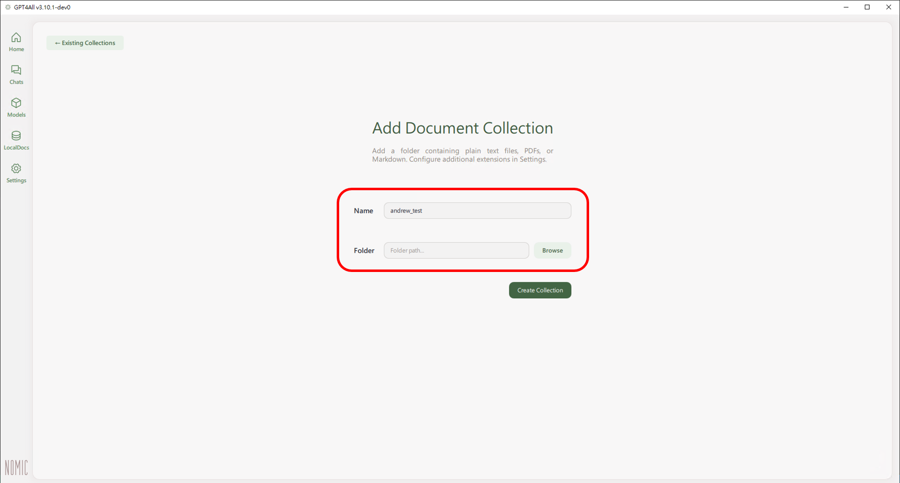
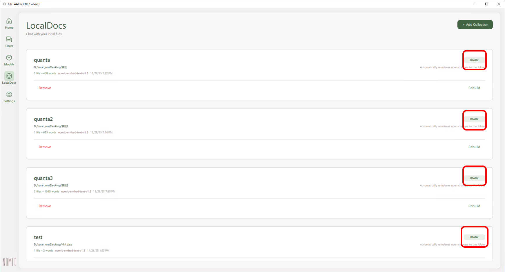
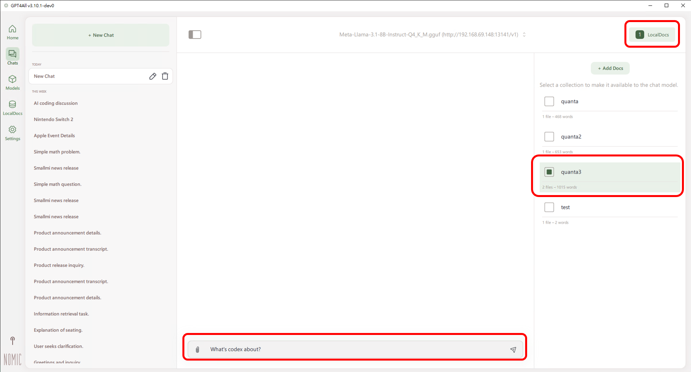

# GPT4all User Guide

## Overview
This application allows users to ask questions from the text user provided. This functionality achieves quick responses from the LLM, enhancing the overall user experience.

---
## Chapter 1: Installation and Setting

### Installation Steps

A. Git clone project

git clone https://github.com/nomic-ai/gpt4all.git --recursive 


B. Download and Place Embedding Model (Required for LocalDocs)

The LocalDocs feature requires an embedding model to generate vector embeddings for your documents. You need to manually download and place the embedding model file.

1. **Download the embedding model:**
   - Download URL: https://gpt4all.io/models/gguf/nomic-embed-text-v1.5.f16.gguf
   - File name: `nomic-embed-text-v1.5.f16.gguf`
   - File size: ~274 MB

2. **Place the embedding model file:**
   - The embedding model must be placed in a `resources` folder that is **one level up** from where `chat.exe` is located.
   - **If `chat.exe` is at:** `aiDAPTIV_Files\Installer\chat.exe`
   - **Then place the model at:** `aiDAPTIV_Files\resources\nomic-embed-text-v1.5.f16.gguf`
   
   Directory structure example:
   ```
   aiDAPTIV_Files/
   ├── Installer/
   │   └── chat.exe          ← Your executable
   └── resources/            ← Create this folder if it doesn't exist
       └── nomic-embed-text-v1.5.f16.gguf  ← Place the model here
   ```

3. **Verify the setup:**
   - After placing the model file, launch `chat.exe`
   - If the model is correctly placed, LocalDocs will work without warnings
   - If you see "Local embedding model not found" warning, check that:
     - The `resources` folder exists at the correct location
     - The file name is exactly `nomic-embed-text-v1.5.f16.gguf`
     - The file is not corrupted (re-download if needed)

**Note:** The embedding model is required for the LocalDocs feature to function. Without it, you will not be able to create collections or generate embeddings for your documents.

---

## Chapter 2: How to Use?

### Usage Workflow

1. **Initial Setup**
- Click on `chat.exe` to launch the chat interface. The chat room automatically created. 
- **Please double check the existent of embedding model, if not please check section E. (Download and Place Embedding Model)**


2. **Set LLM Endpoint**
- Fill in the **LLM Endpoint** and **Model Name** as required.



3. **Set RAG**
- Add a collection and set the folder path. It will automatically pull all the files from the folder path and insert to the collection.
- Please wait for the Ready sign of all collections.



4. **Ask questions**
- Select the collection on the right side. You can start asking questions about the texts you uploaded.
